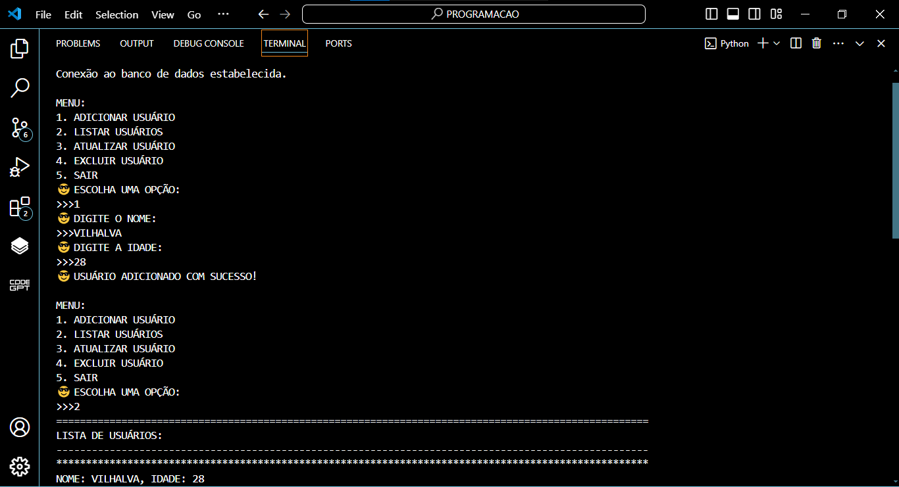
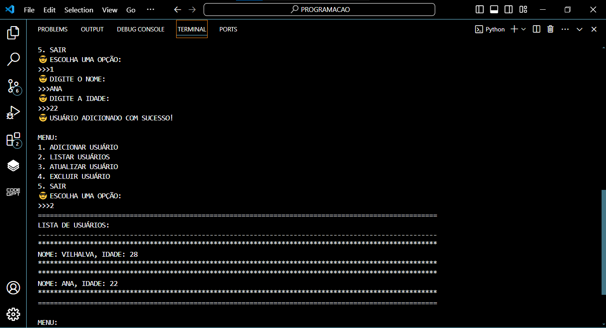
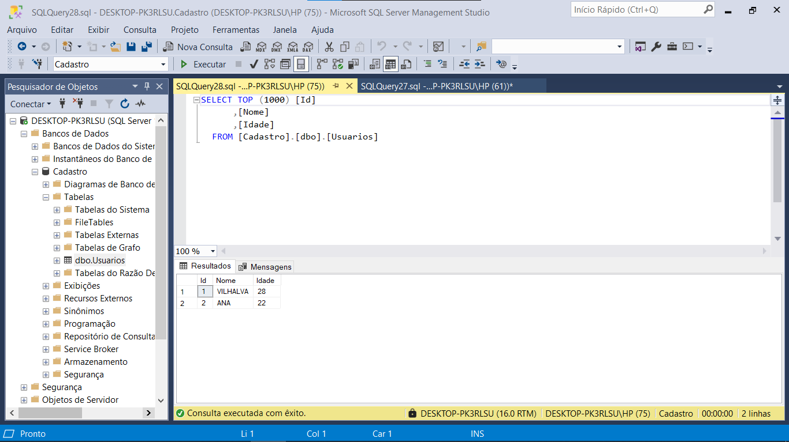

# CRUD PYTHON EM SQL SERVER
🎈GERENCIE O NOME E IDADE DOS USUÁRIOS NA DATABASE SQL SERVER.

 <br>
 <br>
 <br>

## DESCRIÇÃO:
Este aplicativo é um gerenciador de usuários que permite adicionar, listar, atualizar e excluir informações de usuários armazenadas em um banco de dados MySQL CRUD. Ele foi projetado para fornecer uma interface simples e interativa para manipular os dados dos usuários.

Funcionalidades principais:

1. **Adicionar Usuário**: Permite adicionar um novo usuário ao banco de dados, fornecendo o nome e a idade do mesmo.

2. **Listar Usuários**: Apresenta uma lista de todos os usuários cadastrados no banco de dados, mostrando seus nomes e idades.

3. **Atualizar Usuário**: Permite atualizar as informações de um usuário existente no banco de dados, substituindo o nome e/ou a idade pelo novo valor fornecido.

4. **Excluir Usuário**: Remove um usuário específico do banco de dados com base no nome fornecido.

O aplicativo fornece um menu intuitivo para o usuário interagir com essas funcionalidades. Ele utiliza a linguagem de programação Python e o conector MySQL para estabelecer a conexão com o banco de dados e executar as operações de manipulação de dados.

Essa aplicação é útil em cenários onde é necessário armazenar e gerenciar informações de usuários de forma eficiente, como em sistemas de cadastro, administração de usuários em plataformas web, entre outros.

## EXECUTANDO O PROJETO:
### 1. IMPORTAÇÃO DO BANCO DE DADOS:
   - Antes de executar o aplicativo, importe o arquivo `DATABASE.sql` fornecido para o seu banco de dados SQL SERVER. 

### 2. CONFIGURANDO A CONEXÃO COM O SQL SERVER:
Para configurar a conexão com o SQL Server no arquivo `CODIGO.py`, siga os passos abaixo, dependendo do método de autenticação que você está utilizando:

1. **Autenticação do Windows**:
   - Abra o arquivo `CODIGO.py` e localize a seção onde a conexão com o banco de dados é configurada.
   - Se você utiliza autenticação do Windows, insira o seguinte trecho de código para configurar a conexão:
   ```python
   self.conexao = pyodbc.connect(
      'DRIVER={ODBC Driver 17 for SQL Server};'
      'SERVER=DESKTOP-PK3RLSU;'  # Nome do servidor SQL Server
      'DATABASE=Cadastro;'       # Nome do banco de dados
      'Trusted_Connection=yes;'  # Utiliza a autenticação integrada do Windows
   )
   ```

2. **Autenticação do SQL Server**:
   - Se você está usando autenticação do SQL Server (ou seja, um nome de usuário e senha específicos), configure a conexão com as suas credenciais conforme abaixo:
   ```python
   server = 'DESKTOP-PK3RLSU'  # Nome do servidor SQL Server
   database = 'TesteDB'        # Nome do banco de dados
   username = 'meu_usuario'    # Nome de usuário do SQL Server
   password = 'minha_senha'    # Senha correspondente ao usuário
   self.conexao = pyodbc.connect(
      'DRIVER={ODBC Driver 17 for SQL Server};'
      f'SERVER={server};'
      f'DATABASE={database};'
      f'UID={username};'        # Nome de usuário
      f'PWD={password}'         # Senha
   )
   ```

Certifique-se de substituir `DESKTOP-PK3RLSU`, `Cadastro`, `TesteDB`, `meu_usuario` e `minha_senha` pelos valores apropriados ao seu ambiente e configurações.

### 3. INTALANDO AS DEPEDÊNCIAS:
   - Entre no diretório `CODIGO` e execute o comando:

   ```bash
   pip install -r requirements.txt
   ```

### 4. EXECUTANDO O APLICATIVO:
   - Para executar o arquivo Python, utilize o comando abaixo no terminal, dentro do diretório `./CODIGO`:

   ```
   python CODIGO.py
   ```

   - Isso iniciará o aplicativo Python que permite adicionar, listar, atualizar e excluir usuários do banco de dados `cadastro`.

## NÃO SABE?
- Entendemos que para manipular arquivos em muitas linguagens, é necessário possuir conhecimento nessas áreas. Para auxiliar nesse aprendizado, oferecemos cursos gratuitos disponíveis:
* [CURSO DE PYTHON](https://github.com/VILHALVA/CURSO-DE-PYTHON)
* [CURSO DE SQL SERVER](https://github.com/VILHALVA/CURSO-DE-SQL-SERVER)
* [CONFIRA MAIS CURSOS](https://github.com/VILHALVA?tab=repositories&q=+topic:CURSO)

## CREDITOS:
- [PROJETO BASEADO NO "CRUD PYTHON EM MYSQL"](https://github.com/VILHALVA/CRUD-PYTHON-EM-MYSQL)
- [PROJETO FEITO PELO VILHALVA](https://github.com/VILHALVA)


